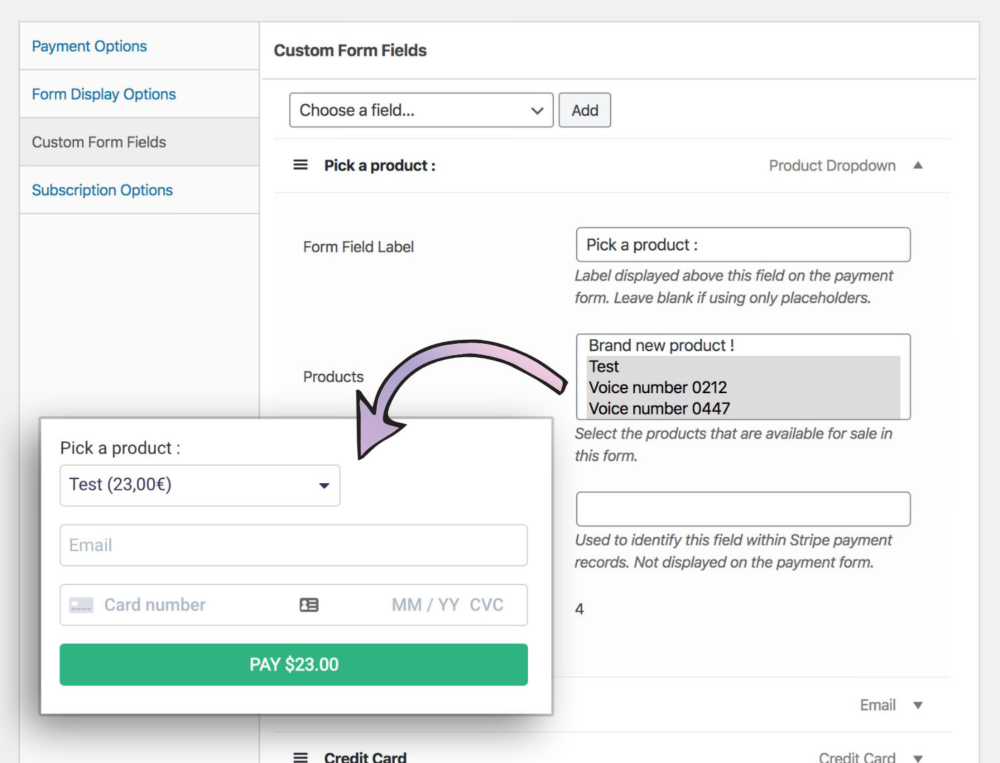

# WP Simple Pay Pro: WooCommerce Product Field

## How to create a custom field in WP Simple Pay Pro?

This plugin is a proof of concept to explain how to create a custom field in WP Simple Pay Pro. It will register a new _WooCommerce Product_ custom field that can be added to WP Simple Pay forms. Customer will be able to **select a WooCommerce product** in a custom dropdown and **pay its corresponding price** by using a Stripe form.

## Code summary
In this plugin, we will:
1. register a new "WooCommerce" group of form fields with the `simpay_custom_field_group_labels` filter
2. register a new "Product Dropdown" custom form field with the `simpay_custom_field_options` filter
3. output our necessary form field settings with the `simpay_admin_{$key}_field_template` filter
4. output the frontend HTML markup for our new WP Simple Pay form field with the `simpay_custom_field_html_for_non_native_fields` filter

## Tutorial
Full tutorial is available on https://saika.li/wp-simple-pay-custom-field